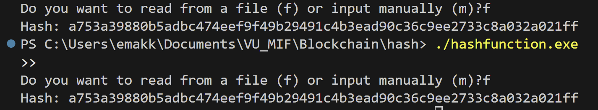
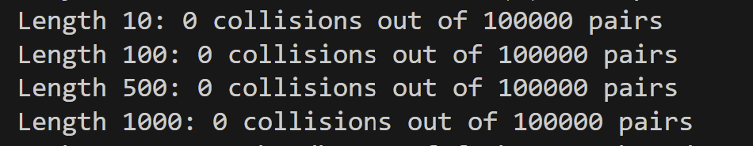

# Blockchain

## Hash funkcijų įgyvendinimas pasitelkiant dirbtinį intelektą (DI):

### Idėja:

```PRADŽIA
    Paklausia vartotojo, kokiu būdu įves input'ą: skaitant failą ar įvedant ranka?
    Jei rankinis įvedimas:
        Nuskaito input'ą su getline()
    Jei failas:
        Atidaro failą
        Nuskaito visas eilutes ir sujungia į vieną string
        Uždaro failą
    Pabaiga jei

    Inicializuoja 4 lane su skirtingais pradžios seed'ais (out[4])

    FOR kiekvienas simbolis input'e
        c = ASCII simbolio reikšmė
        lane = i mod 4

        out[lane] = out[lane] XOR (c * 0x100000001b3)
        out[lane] = pasuka bitus į kairę (i*7 mod 64)
        out[lane] = out[lane] * 0xff51afd7ed558ccd
        out[lane] = out[lane] XOR (out[lane] >> 32)

        other = (lane + 1) mod 4
        out[other] = out[other] XOR pasuka bitus (c + out[lane], i*13 mod 64)
        out[other] = out[other] * 0x9e3779b97f4a7c15
    END FOR

    FOR round = 0 to 3
        FOR j = 0 to 3
            x = out[j]
            x = x XOR pasuka bitus (out[(j+1) mod 4], j*17 + round*11)
            x = x * 0xc2b2ae3d27d4eb4f
            x = x XOR (x >> 29)
            out[j] = x
        END FOR
    END FOR

    Atspausdina out[0..3] kaip 64 simbolių ilgio hex eilutę
PABAIGA

```


### Testing 
- text1.txt file        -> hash: 333b032039bef039c6eb417c030c56591c782cd18c98698d18446fc3f02a7f93
- text2.txt file        -> hash: 32ab04ab717ca70af359dd70eb7f4b3a38860b6f065b290238d36667ec01e47b
- konstitucija.txt file -> hash: a68b86f57c42b9321bcbcc80c26ede09627675aa827b67b68fe4fdd06f2181fa
- text3.txt file        -> hash: cb1719b3fd6c50651a7d15513aed34a03ea506b14d461a642c8d0ac9fb49784f


### Eksperimentinis tyrimas

1. Paruošti šie testiniai failai:
- 2 skirtingi failai su vienu simboliu (a.txt, b.txt)
- failas su >1000 atsitiktinių simbolių (random1.txt)
- failai su >1000 atsitiktinių simbolių, besiskiriančių tik vienu simboliu (random2.txt, random2_mod.txt)
- tuščias failas (empty.txt)

2. Išvedimo dydžio tikrinimas

 |Failas            |Hash                                                              |
 |------------------|------------------------------------------------------------------|
 |a.txt             |43d5f88c36d90c1fd15c9a188a206b1820a9c17f817f562bdaa8c3b226b2b757  |
 |b.txt             |dc473aadc7041b4c784e84c3b29f49861de8031a5bd557f22808a50c8c1dbeeb  |
 |random1.txt       |a753a39880b5adbc474eef9f49b29491c4b3ead90c36c9ee2733c8a032a021ff  |
 |random2.txt       |49939b6a15fe4f8468c66b5a61a6fefbc71958b3f99b84d06b73afc77c825653  |
 |random2_mod.txt   |68142adf8e9646a09f82e07af09d8e8b44d0614ac565a3ee8c27cc40d63e4572  |
 |empty.txt         |65d37efc8d7fbe74319f8f97dd570b623fca7827f232485138b2208970d43764  |

 3. Determiniškumo tikrinimas - tas pats failas duoda tą patį hash'ą

 Pvz. failas random1.txt 
 1 bandymas. Hash: a753a39880b5adbc474eef9f49b29491c4b3ead90c36c9ee2733c8a032a021ff
 2 bandymas. Hash: a753a39880b5adbc474eef9f49b29491c4b3ead90c36c9ee2733c8a032a021ff

 Įrodymas:
 


 4. Kolizijų testas
 Kolizijų nerasta: 

 

5. Efektyvumo matavimas

Repeats per size: 5
Writing raw timings to 'timings.csv'
size=     1 repeat=0 time=0.0022 ms
size=     1 repeat=1 time=0.0018 ms
size=     1 repeat=2 time=0.0013 ms
size=     1 repeat=3 time=0.0013 ms
size=     1 repeat=4 time=0.0014 ms
size=     2 repeat=0 time=0.0022 ms
size=     2 repeat=1 time=0.0021 ms
size=     2 repeat=2 time=0.0021 ms
size=     2 repeat=3 time=0.0021 ms
size=     2 repeat=4 time=0.0021 ms
size=     4 repeat=0 time=0.0034 ms
size=     4 repeat=1 time=0.0034 ms
size=     4 repeat=2 time=0.0034 ms
size=     4 repeat=3 time=0.0035 ms
size=     4 repeat=4 time=0.0035 ms
size=     8 repeat=0 time=0.006 ms
size=     8 repeat=1 time=0.006 ms
size=     8 repeat=2 time=0.006 ms
size=     8 repeat=3 time=0.006 ms
size=     8 repeat=4 time=0.006 ms
size=    16 repeat=0 time=0.0162 ms
size=    16 repeat=1 time=0.0162 ms
size=    16 repeat=2 time=0.0162 ms
size=    16 repeat=3 time=0.0163 ms
size=    16 repeat=4 time=0.0162 ms
size=    32 repeat=0 time=0.0299 ms
size=    32 repeat=1 time=0.0299 ms
size=    32 repeat=2 time=0.0299 ms
size=    32 repeat=3 time=0.0298 ms
size=    32 repeat=4 time=0.0299 ms
size=    64 repeat=0 time=0.0602 ms
size=    64 repeat=1 time=0.0602 ms
size=    64 repeat=2 time=0.0602 ms
size=    64 repeat=3 time=0.0601 ms
size=    64 repeat=4 time=0.0602 ms
size=   128 repeat=0 time=0.1481 ms
size=   128 repeat=1 time=0.1481 ms
size=   128 repeat=2 time=0.1614 ms
size=   128 repeat=3 time=0.1482 ms
size=   128 repeat=4 time=0.1481 ms
size=   256 repeat=0 time=0.3299 ms
size=   256 repeat=1 time=0.3464 ms
size=   256 repeat=2 time=0.2996 ms
size=   256 repeat=3 time=0.3062 ms
size=   256 repeat=4 time=0.2997 ms
size=   512 repeat=0 time=0.6964 ms
size=   512 repeat=1 time=0.7029 ms
size=   512 repeat=2 time=0.6964 ms
size=   512 repeat=3 time=0.6964 ms
size=   512 repeat=4 time=0.7022 ms
size=   789 repeat=0 time=1.1471 ms
size=   789 repeat=1 time=1.1165 ms
size=   789 repeat=2 time=1.1098 ms
size=   789 repeat=3 time=1.1156 ms
size=   789 repeat=4 time=1.1097 ms
